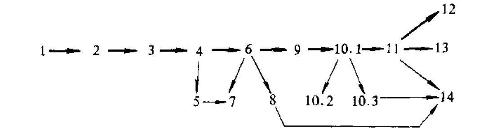

# 内容提要

本书共十四章，一至三章介绍LISP的基本语法、语义、S表达式的概念，以及LISP的核心部分LISP I；四至十章主要讨论LISP的函数程序设计方法；十一至十三章是LISP的非函数程序设计部分；十四章介绍LISP中的一些高级成分和高级应用。

本书以LISP语言为素材，注重训练学生的函数式程序设计的能力，书中用形式化的方法来表述LISP的语义，旨在提高学生的理论素质，同时，书中有大量的例题和习题，涉及到LISP的基本概念直至人工智能领域中的高级应用，仔细阅读这些程序并认真作习题，对学好本课程是十分有益的。

本书可用作高等院校计算机专业的教材或参考书，也可供从事人工智能工作的研究人员、工程技术人员参考。

------

# 前言

本书是供计算机系科学生学习LISP语言的教材。从1983年开始，作者先后在中国科学技术大学研究生院和北京计算机学院讲授LISP语言，由于LISP语言是不断发展变化的，LISP语言的实现和应用也不断发展变化，因此我们的教学内容和所用的讲义也在不断地修改和更新，现在对LISP教材的要求越来越迫切，在国家教委计算机软件教材编审委员会的鼓励下，我们在原讲义的基础之上，经过修改和补充，编写了这本LISP语言教材。

中国科学技术大学研究生院和北京计算机学院的有关师生对本课程的讲授提供了支持和帮助。北京计算机学院王鑫使用本书原稿讲课时指出了其中的若干疏漏。吉林大学庞云阶副教授审阅了全书。对于以上各位，以及为本教材的成书提供帮助的其他所有同志，作者表示深切感谢。

LISP的理论和应用还在发展，因此教材也应不断发展。本书内容虽然在教学中几度改进，但仍难免有各种问题，希望读者能把有关的意见和建议反馈给我们，这对我们今后对工作将大有裨益。

作者谨识

1987年11月于北京

------

# 绪言

## （一）

LISP是==LISt Processing==的缩写，是“表处理”的意思。从历史上看，LISP语言最初是1960年美国的John McCarthy提出来的。当时计算机语言刚刚兴起，FORTRAN、ALGOL等语言也刚处在婴儿阶段，因此LISP语言可以称得上最早的计算机语言之一。

FORTRAN、ALGOL这类语言都是数值计算语言，它是把用机器指令（或汇编）编写数值计算程序时遇到的常用数据结构和程序结构抽象为一些形式记法，使程序员得以摆脱程序设计中最繁琐的细节，从而提高工作效率。对于这些程序员来说，字符处理主要是用在自编格式输出的地方，在FORTRAN中则设计了专门的格式语句来处理这类问题，但格式语句所能做的事，当然不是一般的符号处理。

当时机器翻译和定理证明的研究已经起步，对符号处理语言的需求已经存在。LISP语言把自己的处理对象规定为符号表达式，整数或实数则是符号表达式中极特殊的一个很小的子集。这个语言的出现，大大方便了要做符号处理的程序员，引起了大家的重视。于是，到了1962年，LISP便作为一个实用系统出现了，这就是LISP 1.5。

二十多年过去了，数百种算法语言不断地被提出、实现，绝大多数又都无声无息地消失了，或者只在一个很特殊的范围内被人使用。各种较早的语言，除了FORTRAN靠着强大的经济力量维持到今天外，只有LISP语言正得以广泛的使用，经久不衰。现在，在非数值计算的领域，特别是人工智能领域中，LISP语言占有极重要的地位。

## （二）

计算机语言的理论和实践是不断发展的，发展到一定阶段时，人们对语言有了一些新的认识，这样便需要对已有的语言进行修订、扩充。如果某种语言的基本框架容不下这种修订或扩充，这种语言就要被淘汰。然而LISP语言是以计算机的基础理论——递归函数论为背景的，所以它能顺利地通过所有阶段，得以扩充和完善。

例如数据结构，在FORTRAN语言中，结构化的数据只有一种即数组，亦即数的阵列，而且二维的数组并不是一维数组的阵列，也就是说不是递归定义的，因此数据结构的方式太贫乏、僵死。这种情况从计算能力的角度来说并不是很大的缺陷，因为各种结构化的数据归根结底总可以映象为数组而无需过多的计算开销（从理论上说，只有自然数就足够了，但把结构化的数据映象为自然数，要用到Gödel编码，虽然理论上是可能的，但计算开销太大，实际上完全行不通），但是程序的实践说明，这种映象工作不应交给程序员来做，而应由机器自动完成，于是出现了PASCAL这类具有递归数据结构的语言。

LISP的数据结构虽然单纯，只有符号表达式这一种，但它适用于一切形式系统，因此任何结构化的数据都只是其特例，使用这种符号表达式进行计算时，数据的结构和规模可以不断改变，给程序员提供了极大的方便。

又例如，七十年代人们谈论软件危机，实质上是因为程序越来越大，越来越复杂，以致程序员很难凭朴素的智力来驾驭自己的程序。人们提出了许多解决方案，其中办法之一就是使程序（如何做）与其功能（做什么）一致起来。这导致了函数式程序设计和函数式语言的兴起。意味深长的是，LISP语言早就作为一种函数式语言而存在多年了，后起的许多函数式语言，由于没有根本跳出LISP的框架，所以很少能取得社会地位。

在人工智能领域中，人们逐渐发现，由程序生成一些程序并在适当的时候执行这些程序是十分重要的，这种情况有时可以说成是“数据驱动”，如果用PASCAL或类似的语言来实现这一点，程序员实际上就得为此设计一种语言并写出它的解释程序，LISP语言在这个问题上有着先天的优点，它具有自己解释自己的能力。当程序员需要的时候，他很容易写出一段程序来编制或改造另一段程序，而且随时又可以执行加工出来的程序，甚至一段程序还可以在运行过程中自己修改自己。这本是计算机固有的能力，但大多数语言都不是从计算的理论模型出发设计的，所以就损伤了这种能力。而LISP语言本是就是一个计算模型，其数据的形式和程序的形式是完全一致的，都是符号表达式，因此计算机的这种固有能力就充分表现出来了。在实用系统中，LISP语言的支持环境，如编辑、排误等，都是用LISP实现的，而且可以嵌入在用户程序之中，作为一个标准函数来引用，使这些工具可以更加灵活地得到应用。

LISP的这些优点，来自于它的理论的简单性与透彻性，因此，又可以以LISP为工具（或表达形式）展开对计算理论的研究，并把所得到的结果应用于程序生成、程序验证（或计算逻辑）的研究中去。事实上，这方面的研究有许多是针对LISP语言进行的，大多数又以LISP语言为工具。

## （三）

一个语言有这样的先天优点，使它不可避免地具有早熟的性质，这也使它面临许多困难，这种困难归结到一点就是与现代计算机体系结构的矛盾。

现代计算机的内存是线性地组织起来的。要实现符号表达式，就要大量地使用指针，过多地消耗存储空间，并且影响运行效率。

现代计算机的控制机制是顺序式的，要实现LISP的递归式机制就要组织运行栈，这也会消耗存储空间，影响运行效率。

现代计算机的指令系统主要是为数值计算设计的，其大多数指令对于LISP的实现来说是没有价值的。而LISP所要求的结构转换，只好以指针的转递和重复间接取址来实现，这显然又不能互相配合。

为了解决这些问题，LISP语言不得不向机器让步。LISP 1.5增加的赋值、转向、顺序控制等机制，就是为了这个目的而设计的。

到了七十年代，微电子技术有了新的发展，于是人们开始设计专门的LISP机器来改善这种情况。这方面的工作正在发展之中，但是如何跳出顺序计算的窠臼，则并不是一个容易解决的问题。看来，只有LISP机器得到充分的发展之后，LISP语言早熟的弱点才能被消除，那时，LISP语言才成为一个真正成熟的语言。

## （四）

我们说LISP语言不是一个真正成熟的语言，在实践上主要是指实用软件很少有用LISP语言来编写的。常见的情况是，一个新的软件在实验室阶段用LISP语言写，以便利用LISP语言较灵活的优点加快研制过程；但到了实用阶段，一切都定型了，就改用别的语言重写一遍，以求软件的时空效率。

由于有这种情况，在程序的可移植性方面没有向LISP语言提出过认真的要求，加上LISP语言很容易由用户来扩充，所以到今天为止LISP不但未能标准化，而且标准化的呼声亦不强烈。这就不能想象，LISP语言象汉语一样，有为数极多的方言。一个惯用某种方言的程序员完全看不懂另一个程序员用另一种方言写的程序。当然，语言的核心部分是一致的，但是任何实际的程序都不可能只用核心部分写就，这就给学习LISP的人带来了一些困难。

## （五）

面对这种方言混乱的情况，教学工作怎么办？教材应该怎样写？我们当然只能选用一种方言。在必要的时候，把其它方言的异同介绍一下。学生在实习时，必须在教师的指导下，了解所用的LISP方言的特点，在这方面，查阅文本是必要的，更重要的是上机试验。现行的LISP系统几乎都是对话式的，只要给学生提供充分的机时，他们就有机会对照文本，通过试验来了解所用的LISP系统的特点。这种通过试验来学习的能力是今后使用不同的LISP方言所必须的。

本书所依据的方言，是作者开发的DCLISP。开发这个方言的目的之一正是为了教学。这个方言不是象INTERLISP那样有丰富的系统函数和高级的支持环境，在这一点上这个方言可以说是朴素的，但这个方言有较多的机制，使学生可以学到更多的灵活使用LISP的方法。其中值得特别提到的是：

1. 动态编译机制。多数LISP方言都有编译运行和解释执行两种方式，但由于环境中有矛盾，两者不能动态地改换。DCLISP克服了这个弱点，把两者的环境统一起来，使得程序进行中可以随时在两种方式之间变来变去，以求灵活性和效率更加协调。
2. 可控制的约束机制。LISP系统实现递归调用时有一套参数值约束机制，这在理论上是必须的，但在多数实际程序中，这种做法实际上是一种累赘。DCLISP提供了一种手段使程序员可以干预这种约束机制，以提高时空效率。
3. 按模式传递参数的机制。一般LISP方言传递参数都是把形参表与实参值的表顺次搭配来进行的，在DCLISP中，这种机制被扩大为把形参的模式与实参的值相匹配。这就是本书第四章讲的形参表达式以及第十四章讲的PEXPR表达式和PLET表达式的功能。使用这种方法既可以提高程序的可读性，又可以提高效率。

这些机制都是作者提出的，目前在其它方言中很少见到。

DCLISP还提供了比较丰富的高级函数，其中有一些也是其它方言中少见的，这使DCLISP具有某些泛函式语言的优点，用这些高级函数写出的程序是结构性好，效率高，正确性比较有保障。

为了配合本书的教学，在有条件的情况下，直接采用DCLISP作为教学工具当然是有好处的。

## （六）

现在许多学校的计算机系科都要讲授LISP语言，学生学习LISP语言的目的何在呢？

当然，首先要把LISP语言当作非数值计算，特别是作为表结构变换的工具来学习。另一方面，通过例题和习题，可以学到如何把朴素问题形式化的种种技巧。但是，从作者的观点看，更重要的是应把它作为函数式语言来学习。

前面曾谈到函数式程序设计和函数式语言。所谓函数式语言，就是用函数定义作为程序的说明部分，把函数计算作为程序的执行部分。因此函数式语言实质上就是数学语言。这样，用函数式语言所写的程序就便于程序员掌握了。例如，令
$$
f (x,y,z) = \begin{cases}
z, & 当 y = 0 \\
f (x^2, k, zx), & 当 y = 2k + 1, & k \geqslant 0 \\
f (x^2, k, z), & 当 y = 2k, & k > 0
\end{cases}
$$
那么，用归纳法很容易证明：
$$
f (x, y, z) = zx^2
$$
于是计算3只用求f(3, 5, 1)就行了，所以我们可以写出
$$
\begin{align}
def\ f(x, y, z) &= \\
&(y = 0) &\to & z;\\
&odd(y) &\to & f(x^2, y/2, xz);\\
& & & f(x^2, y/2, z)\\
f (3, 5, 1)
\end{align}
$$
这差不多就是某个函数式的程序了。

同样的程序用PASCAL语言来写，当然也可以使用函数的递归计算的机制，但更自然的办法是使用如下的含有循环语句的函数来编写程序：

```pascal
FUNCTION F (X, Y:INTEGER): INTEGER
VAR Z:INTEGER
BEGIN
	Z: -1;
	WHILE Y > 0 DO
	BEGIN
		IF ODD(Y) THEN Z := Z * X;
		Y := Y DIV 2;
		X := X * X;
	END;
	F := Z;
END;
```

这个写法和数学公式之间有相当的差距。

比较上面两个程序可以看出，函数式的程序较少（或较间接）地涉及计算顺序的细节，较多（或较直接）地涉及计算的目的。这种特点在LISP语言中充分地表现了出来。LISP语言和PASCAL语言在这一方面的区别是很深刻的，程序员使用LISP语言编制程序时的思考方式与使用PASCAL语言也不相同。因此，学习LISP语言的目的之一是要习惯这种思考方式。这是一个技术全面的程序员所应有的能力。从某种意义上说，即使要编一个PASCAL程序，先写出一个函数式的程序作为过渡也是有好处的。

因此，本书在内容安排上尽量突出LISP作为函数语言的特点，多用一些篇幅举例，多给学生一些练习机会，LISP语言中的非函数成分（如PROG、GO、SET等）则放在后面，讲得也比较简单，这些成分对于学过PASCAL等语言的学生不会造成困难。

函数语言在教学上的一个方便之处就是容易作到严谨性和技巧性并重。一般的程序语言教学总是把主要精力放在如何充分利用程序语言的各种机制方面，这就使程序语言课程带有技术性的色彩，有关程序语言的严谨理论则很难放在初级课程中，但函数语言的理论机制比较简单，很容易在教学中兼顾数学上的严谨性。本书很重视这一方面的选材和讲解。学生在学习时如果认真对待这些内容，对提高自己的理论素质可能会有裨益，对于今后涉足于计算机科学的理论领域更有好处。

## （七）

本书共分十四章。一至三章介绍LISP的基本的语法、语义、S表达式的概念，以及LISP的核心部分LISP I；四至十章主要讨论LISP的函数程序设计方法；十一至十三章是非函数程序设计部分；十四章介绍LISP中的一些高级成分和高级应用（实现模式传递参数机制，实现逻辑型语言和泛函数语言）。各章节之间的联系如下图所示：



图中，用粗箭头连接起来的是主干部分，其余则是应用实例。

主干部分主要介绍LISP的各种基本成分，是本课程的基础性内容，但其中也有一些比较深入的内容，如第三章§2全节，§3和§4的后半部分，第六章§2，以及第十章§1的后半部分，略去这些内容或把它们往后安排，不会影响其余部分的教学。此外，第十二章§3和§5主要是应用实例。

程序设计方法需要在实践中学习，因此本书中安排了较多的应用实例。第五章和第七章中的例子的规模是比较小的，其余一些应用实例的规模和难度比较大，教师可以根据实际可能，选一些作课上教材，其它一些留作课外阅读材料。

本书每章后面都附有若干习题。打*号的习题是难度较大或程序量较大的，仔细研读例题之后认真地做好习题，对学好这门课程是十分必要的。