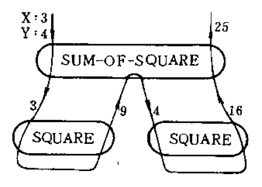
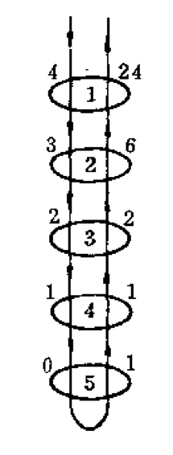
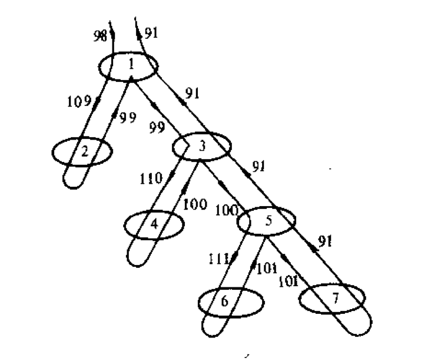

# 第一章 LISP——函数型语言

## §1 前缀表达式

LISP语言（指其核心部分）是一种函数型语言，它与传统的程序设计语言有许多不同之处，最明显的就是：在LISP语言中，程序是由表达式组成的，而不是由语句组成的。我们把做为程序的表达式叫做程序表达式。在LISP系统中，计算的过程是靠对程序表达式的求值来实现的。

从具体形式来看，==LISP的程序表达式是一种前缀表达式==。

在数学中，四则运算符`+`、`-`、`*`、`/`写在两个运算符中间，例如：
$$
3 + 4 \qquad 5 * 2
$$
而在LISP中，要求把运算符写在运算项前面，中间留下必要的空格，并把它们都放在一个括号中。因此，上面两个算术表达式在LISP中应写成：
$$
(+\ 3\ 4) \qquad (*\ 5\ 2)
$$
这就是前缀表达式，如果打开LISP系统，键入以上两个表达式之一，系统就开始进行计算，最后显示出计算的结果`7`或`10`，就是相应的表达式的值。

一个前缀表达式还可以充当更复杂的表达式的运算项。例如`4 - 3 * 2`可以表达为：
$$
(-\ 4\ (*\ 3\ 2))
$$
这里`(* 3 2)`就是减法的第二个运算项，同样，`4 - 3 + 2`则应写成：
$$
( +\ (-\ 4\ 3)\ 2)
$$
即把`(- 4 3)`的值当做加法的第一个运算项。

在许多LISP系统中，不能直接使用`+`、`-`、`*`、`/`做为运算符，必须使用`PLUS`、`DIFFERENCE`、`TIMES`、`QUOTIENT`，此外应注意，一般在LISP语言中只做整数运算，因此`(QUOTIENT 15 4)`的值是`3`，而不是`3.75`。此外，如果要计算除法的余数，可以用`MOD`，例如`(MOD 15 7)`的值是`1`。

实际上，以上这些运算在LISP语言中被看做是二元函数。按照前缀表达式的写法，应把函数名称写在自变量的前面，中间留下必要的空格，并把它们放在一个括号中。例如，`SQUARE`表示平方函数，因此`(SQUARE 5)`的值就是`25`；`ABS`是绝对值函数，`(ABS -41)`的值是`41`.

按照这种看法，如果在一个程序表达式中，某些项目本身又是用程序表达式表示的，就相当于数学中的复合函数了。比如：
$$
(H\ 2\ (G\ 3))
$$
就是数学中的$H(2, G(3))$。

总之，一个程序表达式就是一个LISP程序，LISP程序的执行过程，就是表达式的求值过程，通常称做对表达式的求值。

## §2 函数定义

LISP语言提供一些函数可供用户直接使用，这些函数称为系统函数（又称SUBR型函数），如`PLUS`、`DIFFERENCE`、`TIMES`、`QUOTIENT`、`MOD`等都是大多数LISP系统向用户提供的系统函数。`ABS`、`SQUARE`等函数在有些LISP系统中规定为系统函数，有些LISP系统中则没有这些系统函数，用户需要时，得自己写出它们的定义。

例如要定义平方函数`SQUARE`，可以写

```lisp
(DE SQUARE (X) (TIMES X X))
```

这是一个以`DE`开头的表达式，叫做==定义表达式或DE表达式==。其中的第二项`SQUARE`是要定义的函数的名称，第三项`(X)`是这个函数的形式参数表（简称形参表），这个表中只有一个形式参数（简称形参），就是`X`。第四项`(TIMES X X)`叫做函数的定义体，它说明这个函数的功能就是把自变量的值乘上自己，函数值就是自乘的结果。这样，计算

```lisp
(SQUARE 5)
```

就相当于在`X`取`5`为值的情况下，计算

```lisp
(TIMES X X)
```

也就是计算

```lisp
(TIMES 5 5)
```

的值，结果是`25`。

函数的定义体也应该是一个表达式，与上节所说的程序表达式相比，这种表达式在应该出现常数的地方出现了做为变量的形式参数。这种含有形式参数的表达式也叫做程序表达式，极而言之，一个常数或一个形式参数也算做一个程序表达式，例如：

```lisp
(DE SELF (X) X)
```

定义了一个函数`SELF`，它的功能就是把自变量的值直接当作函数值。例如`(SELF 6)`的值就是6。

下面的表达式

```lisp
(DE SUM-OF-SQUARE (X Y) (PLUS (SQUARE X) (SQUARE Y)))
```

定义了函数`SUM-OF-SQUARE`，这个函数的形参表中有两个形参`X`、`Y`。定义体是

```lisp
(PLUS (SQUARE X) (SQUARE Y))
```

其中又含有上面定义的函数`SQUARE`。

这样，要计算表达式

```lisp
(SUM-OF-SQUARE 3 4)
```

就相当于计算

```lisp
(PLUS (SQUARE 3) (SQUARE 4))
```

这就又相当于计算

```lisp
(PLUS (TIMES 3 3) (TIMES 4 4))
```

先得到

```lisp
(PLUS 9 16)
```

再得到最后的结果：

```lisp
25
```

引用一个函数的定义来计算一个表达式的值，叫做对这个函数的一次调用。在调用一个函数时，每个形参都得到一个值，叫做它的==约束值==。在上面的计算过程中，共有三次调用：一次调用了`SUM-OF-SQUARE`，两次调用了`SQUARE`。后者是在计算`SUM-OF-SQUARE`的定义体时发生的，这种情况常常说成是“`SUM-OF-SQUARE`调用`SQUARE`”。

我们可以用一种调用关系图（`图 1-1`）表示这些关系：



在这个图上，分别标出了每次调用的函数名称，相应的形参约束值（入口值）和函数的值（返回值）。`SQUARE`函数只有一个形参`X`，在图上就不注明了，`SUM-OF-SQUARE`有两个形参`X`和`Y`，图上分别注明了它们的约束值`3`和`4`。把图上的箭头联接成一条曲线，表明调用的顺序。

## §3 条件表达式

我们常常遇到分情况定义的函数，例如绝对值函数可以定义为
$$
|x| = \begin{cases}
x, & 当 x > 0 \\
0, & 当 x = 0 \\
-x, & 当 x < 0
\end{cases}
$$
要用LISP写出这个函数的定义，首先就遇到 $x > 0$、$x = 0$、$x < 0$ 应如何表达的问题。在LISP中，这些也用前缀表达式的办法来写。用`GREATERP`、`EQN`、`LESSP`分别表示`大于`、`等于`、`小于`，那么上面这三个关系应分别写成`(GREATERP X 0)`、`(EQN X 0)`、`(LESSP X 0)`。

`GREATERP`、`EQN`和`LESSP`都是二元函数，它们的函数值只有`真`、`假`两种值。==这种只取真假为值的函数通常叫做谓词==。在LISP中，`真`记为`T`，`假`记为`NIL`。因此

```lisp
(GREATERP 5 4)
(EQN 3 2)
(LESSP 5 5)
```

的值分别是`T`、`NIL`和`NIL`，这些也都是程序表达式。

绝对值函数的定义写作：

```lisp
(DE ABS (X)
  (COND ((GREATERP X 0) X)
        ((EQN X 0) 0)
        ((LESSP X 0) (DIFFERENCE 0 X))))
```

这里，作为定义体的程序表达式第一项是`COND`，这样的表达式叫做==条件表达式或COND表达式==。这也是一种程序表达式，但它的形式以及求值的步骤都有特殊的约定。

条件表达式的一般形式是

```lisp
(COND 子句, ... 子句。)
```

每个子句又由两部分组成，其一般形式是

```lisp
(检验条件 动作表达式)
```

而检验条件和动作表达式都是程序表达式。在上面的例子中，第一个子句的检验条件是`(GREATERP X 0)`，动作表达式是`X`，第二个子句的检验条件是`(EQN X 0)`，动作表达式是`0`，第三个子句的检验条件是`(LESSP X 0)`，动作表达式是`(DIFFERENCE 0 X)`。

对条件表达式求值的时候，顺次计算各子句中的检验条件的值，直到遇到一个值不少`NIL`的检验条件为止，然后，转而计算相应子句中的动作表达式的值，并把它的值做为条件表达式的值。如果每一个检验条件的值都是`NIL`，那么久规定条件表达式的值为`NIL`。（将来可以看到这种规定的好处。）

在上面的例子中，如果X的约束值是`3`，（就是说要计算`(ABS 3)`的值，）那么第一个子句的检验条件的值就是`T`，于是计算第一个子句的动作表达式的值，得到`3`，这就是条件表达式的值。如果`X`的约束值是`-5`，那么第一、第二个子句的检验条件的值都是`NIL`，而第三个子句的检验条件的值是`T`，所以条件表达式的值就是这个子句中的动作表达式的值，即`(DIFFERENCE 0 -5)`的值，就是`5`。

这种做法可以更形式地叙述如下：

条件表达式的值是：

1. 如果其中没有子句，则值为`NIL`。
2. 如果第一个子句的检验条件的值不是`NIL`，则条件表达式的值就是第一个子句的动作表达式的值。（其余子句不予处置。）
3. 以上两条都不满足时，条件表达式的值等于从中删去第一个子句后得到的新的条件表达式的值。

按照这个规定，要计算`(ABS -5)`的值，相当于求下面的条件表达式的值：

```lisp
(COND ((GREATERP -5 0) -5)
      ((EQN -5 0) 0)
      ((LESSP -5 0) (DIFFERENCE 0 -5)))
```

这里第一个子句的检验条件值是`NIL`，按规定，这个表达式的值等于下面的条件表达式的值：

```lisp
(COND ((EQN -5 0) 0)
      ((LESSP -5 0) (DIFFERENCE 0 -5)))
```

这时，第一个子句的检验条件`(EQN -5 0)`的值又是`NIL`，于是又要对下面的条件表达式求值：

```lisp
(COND ((LESSP -5 0) (DIFFERENCE 0 -5)))
```

这一次第一个子句的检验条件`(LESSP -5 0)`的值是`T`，于是所求的值就等于下面的表达式的值：

```lisp
(DIFFERENCE 0 -5)
```

结果是`5`。

条件表达式各子句中的检验条件不一定非使用谓词不可，任何程序表达式都可以用作检验条件，我们规定只要检验条件的值不是`NIL`，就都按同样的办法处理，这实际上就是把除了`NIL`以外的任何值（例如`0`或别的数）都看做检验的结果为真。`T`和`NIL`都是常量，有时要用`T`作为检验条件，如果它前面的检验条件值都是`NIL`，就会检验这个表达式，其结果当然为真，于是它后面的动作表达式的值就是条件表达式的值，因此，用`T`作为检验条件，其效果相当于数学定义中的“否则的话…”或者“在其它情况下…”，例如绝对值的定义也可以写成
$$
|x| = \begin{cases}
0 - x, & 当 x < 0 \\
x, & 否则
\end{cases}
$$
那么，相应的LISP定义就应写成

```lisp
(DE ABS (X)
  (COND ((LESSP X 0) (DIFFERENCE 0 X))
        (T X)))
```

值得注意的是，最后一个子句中的检验条件也可以写成`0`，`1`甚至`X`，但上面的写法最自然。

## §4 递归定义的函数

阶乘函数可以定义为：
$$
g(n) = \begin{cases}
1, & 当 n = 0 \\
n * g(n - 1), & 否则
\end{cases}
$$
用LISP语言则写成：

```lisp
(DE FACTORIAL (N)
  (COND ((ZEROP N) 1)
        (T (* N (FACTORIAL (SUB1 N))))))
```

其中`(ZEROP N)`相当于`(EQN N 0)`，`(SUB1 N)`相当于`(DIFFERENCE N 1)`。

注意，这个定义的定义体内含有被定义的函数，从数学的观点来看，这种定义是一种隐式定义，因为它并未明确地说明阶乘到底是什么，（甚至没有说明其定义域限于自然数。）只是把阶乘定义为一个方程的解，于是就发生了存在唯一性的问题，研究这类问题超过了本书的范围。

但是从计算的角度来看，这种定义确实提供了一种计算的办法，例如要计算`(FACTORIAL 4)`，从定义，它应等于

```lisp
(COND ((ZEROP 4) 1)
      (T (* 4 (FACTORIAL (SUB1 4)))))
```

根据条件表达式的求值规则，它的值就是

```lisp
(* 4 (FACTORIAL (SUB1 4)))
```

而`(SUB1 4)`的值是`3`，因此，所求的值应该是如下的表达式的值：

```lisp
(* 4 (FACTORIAL 3))
```

要计算这个表达式的值，又要求出`(FRACTORIAL 3)`的值，再一次调用函数`FACTORIAL`，但这并不是无为地回到开始，因为这一次调用时，形参的约束值改变了。

计算`(FACTORIAL 3)`的过程，会导致对下面的表达式求值：

```lisp
(* 3 (FACTORIAL 2))
```

我们又遇到了`(FACTORIAL 2)`，再次调用`FACTORIAL`函数，又会遇到

```lisp
(* 2 (FACTORIAL 1))
```

再调用一次，成了

```lisp
(* 1 (FACTORIAL 0))
```

现在还要调用`FACTORIAL`函数，这一次调用时，形参的约束值是`0`，这样一来，`(ZEROP 0)`的值是`T`，而函数值就是`1`。

倒推回去，`(FACTORIAL 1)`的值是

```lisp
(* 1 1)
```

就是`1`；`(FACTORIAL 2)`的值是

```lisp
(* 2 1)
```

就是`2`；`(FACTORIAL 3)`的值是

```lisp
(* 3 2)
```

就是`6`；最后，`(FACTORIAL 4)`的值是

```lisp
(* 4 6)
```

就是`24`。

这个计算过程中，我们一共调用了五次`FACTORIAL`，除了第五次调用以外，每一次都是由某个`FACTORIAL`调用另一个`FACTORIAL`，调用关系图如`图 1-2`所示。



这个图中分别用`1`、`2`、`3`、`4`、`5`表示对`FACTORIAL`的五次调用。

定义体中含有要定义的函数自身，这样的定义叫做递归定义，相应的计算过程叫做递归调用过程，递归定义是LISP程序设计的基本技巧之一。

再举一个例子，下面的函数叫做`McCarthy 91`函数：

```lisp
(DE M91 (N)
  (COND ((GREATERP N 100) (- N 10))
        (T (M91 (M91 (+ N 11))))))
```

这相当于数学的写法：
$$
g(n) = \begin{cases}
n - 10, & 当 n > 100 \\
g(g(n + 11)), & 否则
\end{cases}
$$
计算$g(98)$的过程是：
$$
\begin{align}
g(98) & = g(g(98 + 11)) & = g(g(109)) \\
& = g(109 - 10) & = g(99) \\
& = g(g(99 + 11)) & = g(g(110)) \\
& = g(110 - 10) & = g(100) \\
& = g(g(100 + 11)) & = g(g(111)) \\
& = g(111 - 10) & = g(101) \\
& = 101 - 10 & = 91
\end{align}
$$
这里共有七次调用，用LISP的调用关系图来表示如`图 1-3`所示



## §5 尾递归

在计算一个复杂的表达式的时候，常常出现函数调用的情况，而不同函数中使用的形参名称有时相同，因此，必须有一套适当的机制来分清同一名称的形参在不同函数调用时的不同约束值。换句话说，当一个函数调用另一个函数的时候，应把自己的形参约束值保存起来，免得干扰被调用函数的形参约束值；当被调用的函数求值完成之后，再恢复自己的形参约束值。这种机制要消耗一定的存储空间和计算时间，这种情况在递归调用的时候尤为严重。

也有例外的情况：如果被调用函数的返回立即引起调用它的函数的返回，那么，在调用时就不必保存形参的约束值。这种递归方式称作尾递归。我们先看一个例子。

如果要计算二元函数
$$
g(n, m) = n! * m
$$
除了利用上节定义的`FACTORIAL`而写出

```lisp
(DE FACT (N M) (* (FACTORIAL N) M))
```

以外，还可以预先做一点数学讨论，以便简化计算。

由阶乘的定义可以看出：
$$
g(n, m) = \begin{cases}
m, & 当 n = 0 \\
n * (n - 1)! * m, & 否则
\end{cases}
$$
其中n * (n - 1)! * m = (n - 1)! * (n * m) = g(n - 1, n * m)，于是有：
$$
g(n, m) = \begin{cases}
m, & 当 n = 0 \\
g(n - 1, n * m), & 否则
\end{cases}
$$
若要计算$g(4, 1)$，那么由定义，应计算$g(3, 4)$，而$g(3, 4)$的值就是$g(4, 1)$的值。这样，系统就有理由“忘记”它是在计算$g(4, 1)$时调用$g(3, 4)$，而索性“认为”要进行求值的就是$g(3, 4)$，用这个办法计算$g$的值比上面定义中写的表达式简单，所以不如改定义如下：

```lisp
(DE FACT (N M)
  (COND ((ZEROP N) M)
        (T (FACT (SUB1 N) (* N M)))))
```

注意，这个定义中不含有`FACTORIAL`，而阶乘函数也可以改定义为

```lisp
(DE FACTORIAL (N) (FACT N 1))
```

这样，计算`FACTORIAL`的过程也就可能简化了，当然，简化到何种程度，要视不同的LISP系统而定。

再以上节的`McCarthy 91`函数为例，这个函数在求值过程中大体上是尾递归的，比如：
$$
\begin{align}
g(89) & = g(g(100))  & = g(g(g(111))) \\
& = g(g(101))  & = g(91) \\
& = g(g(102)) & = g(92) \\
& = \cdots
\end{align}
$$
只是会发生复合函数的层数的涨消变化，我们可以另外定义一个函数：
$$
h(n, m) = \underbrace{g(g(\cdots g(n)}_{\text m层} \cdots))
$$
那么，由91函数的定义可以看出
$$
h(n, m) = \begin{cases}
n, & 当 m = 0 \\
h(n - 10, m -1), & 当 m > 0，n > 100 \\
h(n + 11, m + 1), & 当 m > 0，n \leqslant 100
\end{cases}
$$
这样就可以写出

```lisp
(DE H (N M)
  (COND ((ZEROP M) N)
        ((GREATERP N 100) (H (- N 10) (SUB1 M)))
        (T (H (+ N 11) (ADD1 M)))))
```

这里的`(ADD1 M)`相当于`(PLUS M 1)`。

然后，91函数可以重新定义为：

```lisp
(DE M91 (N) (H N 1))
```

`H`的计算过程是真正的尾递归，从而M91函数的计算也就有了简化的可能。

从上面的例子来看，要找出一个递归函数怎样用尾递归的办法定义，是一种技巧性的问题，其一般的理论是相当复杂的，有些函数，如下面的`Ackermann`函数，要化成尾递归需要引入新的数据结构：
$$
Ack(n, m) = \begin{cases}
m + 1, & 当 n = 0 \\
Ack(n - 1, 1), & 当 n > 0, m = 0 \\
Ack(n - 1, Ack(n, m - 1)), & 其它情况
\end{cases}
$$
（详见第五章§3）。

## 习题

### 1.1 用前缀表达式写出：

$$
\dfrac{3^2 - 3 * 4 + 4^2}{3 + 4} \qquad |5 - 10|^2 + |5 - 1|^2
$$

### 1.2 写出以下函数的定义：

1. $add1(x) = x + 1;$
2. $sub1(x) = x - 1;$
3. $remainder(x, y) = 用y除x所得的余数；$
4. $zerop(x), 恒为0的函数$

### 1.3 用条件表达式写出：

$$
x \lor y, \qquad x \land y, \qquad \lnot x
$$

### 1.4 写出以下谓词的定义：

$$
\begin{alignat}{0}
positive(x) & 当x为正数时值为T \\
one\textrm{-}digit(x) & 当x为一位数时值为T \\
divided\textrm{-}by(x, y) &当x能被y整除时值为T \\
odd(x) & 当x是奇数时值为T
\end{alignat}
$$

### 1.5 写出以下函数的递归定义：

1. $p2(n) = 2^n;$
2. $s(n) = 1 * 2 + 2 * 3 + \cdots + n * (n + 1);$
3. $gcd(x, y) = x 与 y 的最大公约数$（用辗转相减法）。

### 1.6 对上题的（3）给出计算`(GCD 10 14)`的调用关系图

### 1.7 写出 $g(x, y) = x^y$ 尾递归计算的办法

提示：利用辅助函数$x^y * z$，每次递归时使y的值减半（分奇、偶两种情况）。

### 1.8 写出`square-root`函数用尾递归计算的定义

### 1.9 `Fibonacci`数列的通项公式是

$$
a_n = \begin{cases}
n, & 当 n = 0, 1 \\
a_{n-1} + a_{n-2}, & 当 n > 1
\end{cases}
$$

试写出计算$a_n$的递归定义的函数。此外，利用辅助函数
$$
h(n, m, k) = m * a_n + k * a_{n-1}
$$
设法写出用尾递归计算$a_n$的办法，对于$a_5$的计算比较两种不同的计算过程。

### 1.10 写出`Ackermann`函数的定义，画出`Ack(2, 1)`的调用关系图